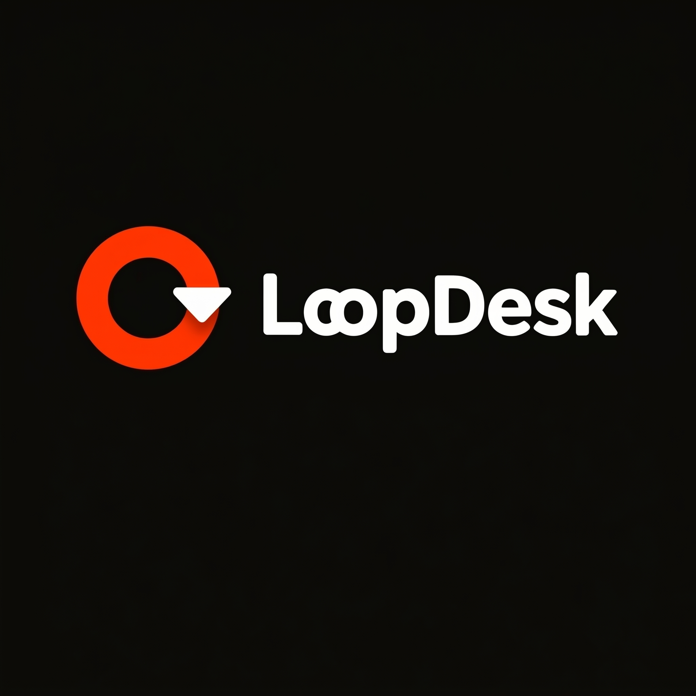

# LoopDesk



**Self-improving AI support triage. Resolving tickets, intelligently.**

**Live → [loop-desk.vercel.app](https://loop-desk.vercel.app)**

---


---

## What it does

LoopDesk is a production-grade multi-agent support triage system. It classifies, routes, and auto-resolves customer support tickets using LangGraph and Claude Sonnet 4.6. What makes it different — it gets smarter every time a human corrects it. No retraining. No fine-tuning.

---


Submit any support ticket. The agent classifies it, searches the relevant documentation, scores its own confidence, and either resolves it automatically or escalates to a human reviewer with a pre-written context summary.

---

## Architecture

```
Customer submits ticket
        ↓
LangGraph classifier (GPT-4o-mini)
        ↓ routes to
┌───────────────────────────────┐
│  Billing Agent                │
│  Technical Agent              │  ← Claude Sonnet 4.6 + ChromaDB RAG
│  General Agent                │
└───────────────────────────────┘
        ↓
Confidence scoring (GPT-4o-mini)
        ↓
High confidence  →  Auto-resolved
Low confidence   →  Escalated + context summary
        ↓
Human reviews via Reviewer Dashboard
        ↓
Correction saved to Supabase
        ↓
Agent learns — few-shot injected on next similar ticket
```

---

## How the auto-learning works

```
Agent answers ticket
        ↓
Human marks it correct or wrong
        ↓
Correction stored in Supabase (permanent, survives deploys)
        ↓
Next similar ticket → correction injected as few-shot example
        ↓
Agent routes correctly without any code changes
```

This mirrors RLHF at a systems level — without touching model weights.

---

## Results

Tested across 21 ticket types including edge cases:

| Metric | Result |
|---|---|
| Core support tickets resolved correctly | 18/18 |
| Gibberish / off-topic escalated correctly | 5/5 |
| Corrections needed to fix routing errors | 8 |
| Retraining required | 0 |
| Hallucinations detected | 0 |

---

## Tech Stack

| Layer | Technology |
|---|---|
| Agent Orchestration | LangGraph |
| RAG + Prompting | LangChain |
| Specialist LLM | Claude Sonnet 4.6 (Anthropic) |
| Classifier LLM | GPT-4o-mini (OpenAI) |
| Vector Store | ChromaDB |
| Corrections Store | Supabase (PostgreSQL) |
| Observability | LangSmith |
| Workflow Automation | n8n |
| API | Flask + Flask-CORS |
| Frontend | HTML / CSS / JS |
| Backend Deployment | Render |
| Frontend Deployment | Vercel |

---

## Project Structure

```
loopdesk/
├── webhook.py              ← Flask API — main entry point
├── app.py                  ← Streamlit UI (backup demo)
├── index.html              ← Landing page with live demo
├── static/
│   └── Logo.png
├── agent/
│   ├── graph.py            ← LangGraph state machine
│   ├── classifier.py       ← Classifier node (GPT-4o-mini)
│   ├── confidence.py       ← Confidence scoring + escalation
│   └── agents/
│       ├── billing.py      ← Billing specialist (Claude Sonnet 4.6)
│       ├── technical.py    ← Technical specialist (Claude Sonnet 4.6)
│       └── general.py      ← General specialist (Claude Sonnet 4.6)
├── rag/
│   ├── loader.py           ← Document loader + chunker
│   └── retriever.py        ← ChromaDB retriever
├── memory/
│   └── corrections.py      ← Supabase-backed correction store
└── docs/
    ├── billing_faq.txt
    ├── technical_faq.txt
    └── general_faq.txt
```

---

## Setup

### Prerequisites

- Python 3.10+
- OpenAI API key
- Anthropic API key
- Supabase project
- LangSmith API key

### Installation

```bash
git clone https://github.com/gitshiven/LoopDesk
cd LoopDesk
python -m venv venv
source venv/bin/activate
pip install -r requirements.txt
```

### Environment Variables

```
OPENAI_API_KEY=your-openai-key
ANTHROPIC_API_KEY=your-anthropic-key
SUPABASE_URL=your-supabase-url
SUPABASE_ANON_KEY=your-supabase-anon-key
LANGSMITH_API_KEY=your-langsmith-key
LANGSMITH_TRACING=true
LANGSMITH_PROJECT=loopdesk
```

### Supabase Setup

```sql
CREATE TABLE corrections (
  id SERIAL PRIMARY KEY,
  message TEXT NOT NULL,
  wrong_category TEXT,
  correct_category TEXT NOT NULL,
  note TEXT,
  created_at TIMESTAMP DEFAULT NOW()
);
```

### Run Locally

```bash
python webhook.py
```

---

## Deployment

**Backend** — Render: `https://loopdesk-pl8q.onrender.com`

**Frontend** — Vercel: `https://loop-desk.vercel.app`

Note: Render free tier spins down after inactivity. Use UptimeRobot to keep it awake.

---

## Use it for your own business

Replace files in `/docs` with your own FAQ and policy documents, delete `chroma_db/`, rebuild the vector store, and redeploy. The agent learns your business in minutes.

---

## Built by

**Shiven Singh** — [github.com/gitshiven](https://github.com/gitshiven)

---

MIT License
